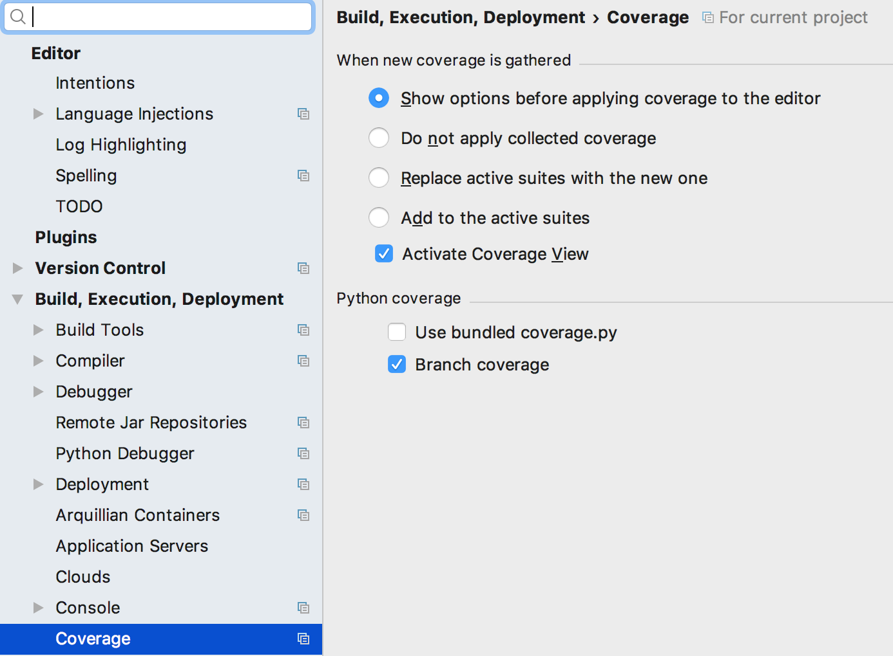

Using IntelliJ
===

Getting branch coverage
---
As per default, branch coverage is not activated in IntelliJ.
When you run a test you get line coverage, which is not the whole 
truth.

Go Settings/Preferences dialog, select Coverage under Build, Execution, Deployment.
Click the check box for branch coverage. 

If you have branch coverage, the code will be marked with both red, yellow and green
to indicate no coverage, partial coverage and full coverage. Running with line coverage
will only indicate red or green.

